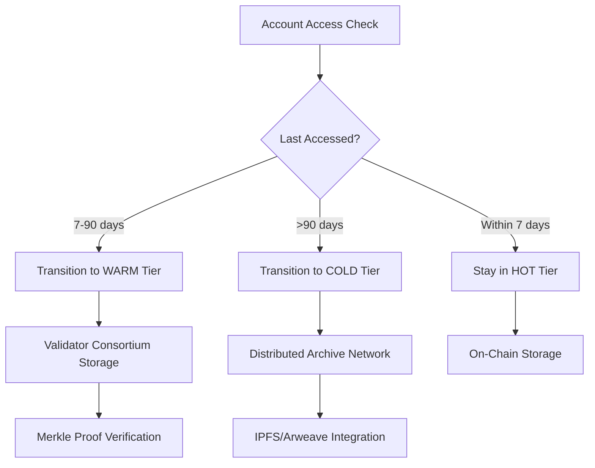
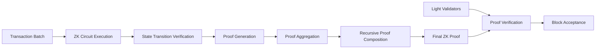
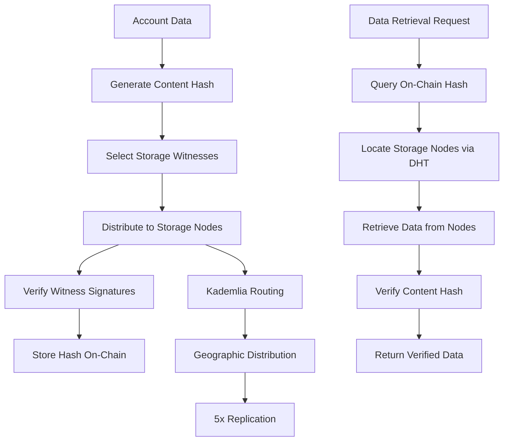

# Solana State Bloat Research: Advanced Protocol-Level Solutions for Enduring Data Storage

## Executive Summary

Solana's state bloat problem represents one of the most critical scalability challenges facing high-throughput blockchains today. With live account state reaching **500 GB** and the full unpruned ledger exceeding **400 TB**, validator hardware requirements have escalated to enterprise-grade specifications: **384+ GB RAM**, **multi-TB NVMe storage**, and operational costs of **\$500-1,000 monthly per validator**. Current growth rates of **80-95 TB annually** make this unsustainable without fundamental architectural changes.[^1][^2][^3][^4]

The proposed SIMD-0341 state compression solution, while reducing storage costs, introduces significant trade-offs including **data interoperability degradation**, **broken CPI calls**, and **dependency on centralized off-chain storage**. This analysis presents three comprehensive protocol-level solutions that maintain Solana's simplicity while addressing validator burden, developer experience, and user seamlessness.[^5]

## Problem Analysis: Quantifying Solana's State Bloat Crisis

### Current State Metrics

Solana's architectural design requiring **all account data to be stored on-chain and replicated across all validators indefinitely** creates an exponentially growing burden. Unlike Bitcoin's **~400 GB** total chain size with **1.2% efficient UTXO pruning** capability, or Ethereum's **~300 GB state** with **limited pruning options**, Solana's state represents **43% of total chain size** with **no viable pruning mechanisms**.[^6][^7]

### Validator Hardware Escalation

The hardware requirements for Solana validators have reached enterprise levels:[^1][^2][^8]

| Component | Specification | Notes |
|-----------|---------------|-------|
| **CPU** | AMD EPYC 24+ cores with 4.0+ GHz frequency boost | Required for transaction processing |
| **RAM** | 384-512 GB ECC DDR5 (minimum), 768 GB-1 TB recommended | Critical for state management |
| **Storage** | 4-drive configuration:<br>- 2x 500GB NVMe RAID1 (OS)<br>- 1x 2TB NVMe (accounts)<br>- 1x 4TB NVMe (ledger) | Total ~7TB NVMe storage |
| **Network** | 1-10 Gbps symmetric with 100+ TB monthly bandwidth | High bandwidth for state replication |


### Economic Impact on Ecosystem Participants

| Stakeholder | Key Challenges | Impact |
|-------------|----------------|--------|
| **Validators** | - Monthly operational expenses: \$500-1,000 per validator<br>- Hardware replacement cycles: 2-3 years due to intensive disk usage<br>- High barrier to entry limiting network decentralization | Unsustainable costs threatening network security and decentralization |
| **Developers** | - Simple account rent exemption: 0.001-0.01 SOL (~\$0.20-2.00)<br>- Complex application storage costs scaling linearly with data requirements<br>- Frequent complaints on forums about deployment costs exceeding \$300-600 for non-trivial contracts | Rent friction discouraging development and innovation |


## Proposed Solutions: Three-Tiered Approach

### Solution 1: Tiered State Architecture (TSA)

**Core Design Philosophy**: Implement a multi-tier storage system that maintains data availability while reducing validator storage requirements through intelligent state classification.

#### Technical Architecture

**Tier 1: Hot State (On-Chain)**

- **Active accounts** accessed within **7 days**
- **Critical system accounts** (validators, programs, governance)
- **High-frequency trading pairs** and **DeFi protocols**
- Storage: **~50-100 GB per validator**

**Tier 2: Warm State (Validator Consortium)**

- **Semi-active accounts** accessed within **30-90 days**
- Stored by **rotating validator subsets** (33% of network)
- **Merkle proof verification** for state transitions
- **Incentivized storage** through extended staking rewards

**Tier 3: Cold State (Distributed Archive Network)**

- **Inactive accounts** not accessed for **90+ days**
- **IPFS/Arweave integration** with **cryptographic commitments**
- **On-demand retrieval** with **15-second maximum latency**
- **Economic incentives** for archive node operators


#### Implementation Mechanics

**State Transition Algorithm**:

```
if (account.last_accessed < current_time - 7_days && account.tier == HOT) {
    initiate_warm_transition(account);
} else if (account.last_accessed < current_time - 90_days && account.tier == WARM) {
    initiate_cold_transition(account);
}
```

**State Transition Flow Diagram**:



**Retrieval Protocol**:

- **Warm-to-Hot**: Automatic upon access, **<1 second latency**
- **Cold-to-Warm**: Requires **Merkle proof submission**, **5-15 second latency**
- **Direct Cold-to-Hot**: Emergency access path, **higher transaction fees**


#### Benefits Analysis

**For Validators**:

- **90% reduction** in required storage (500 GB → 50 GB hot state)
- **Hardware costs drop** from \$8,000 to \$3,000 per validator
- **Monthly operational savings**: \$300-500 per validator
- **Enhanced network decentralization** through lower entry barriers

**For Developers**:

- **Predictable tier-based pricing**: Hot (current rates), Warm (50% discount), Cold (90% discount)
- **Automatic tier management** - no code changes required
- **API compatibility** maintained through transparent retrieval

**For Users**:

- **Zero interface changes** - retrieval handled transparently
- **Slightly increased latency** for cold state access (acceptable for inactive accounts)
- **Lower overall network fees** due to reduced validator costs


#### Economic Model

**Storage Rent Structure**:

- **Hot State**: Current rent rates (0.001-0.01 SOL)
- **Warm State**: 50% discount with **validator consortium rewards**
- **Cold State**: 90% discount with **archive network payments**

**Validator Incentives**:

- **Warm storage rewards**: +15% staking yield for participation
- **Archive node rewards**: **0.5% of total inflation** distributed to storage providers


### Solution 2: Zero-Knowledge State Verification (ZKSV)

**Core Design Philosophy**: Leverage **zero-knowledge proofs** to enable **stateless validation** while maintaining security guarantees and data availability.

#### Technical Architecture

**ZK State Commitments**:

- **Merkle Patricia Trie** with **zk-SNARK proofs** for state transitions
- **Recursive proof aggregation** enabling **constant verification time**
- **Universal setup** eliminating per-application trusted setup requirements[^12][^13]

**Validator Role Transformation**:

- **Full validators**: Maintain **complete state** + **generate ZK proofs**
- **Light validators**: Store only **state roots** + **verify proofs**
- **Archive nodes**: Provide **historical state** with **cryptographic guarantees**


#### ZK Circuit Design

**State Transition Circuit**:

```
circuit StateTransition {
    private input: old_state, transaction_batch, private_keys
    public input: old_state_root, new_state_root, transaction_hashes
    
    // Verify old state membership
    assert(verify_merkle_proof(old_state, old_state_root));
    
    // Execute transactions
    new_state = execute_transactions(old_state, transaction_batch);
    
    // Verify new state root
    assert(compute_merkle_root(new_state) == new_state_root);
}
```

**Proof Aggregation**:

- **Batch processing**: Aggregate **1000+ transactions** per proof
- **Recursive composition**: Enable **unlimited scalability**
- **Hardware acceleration**: **GPU-optimized circuits** reducing proof time to **<10 seconds**[^14]

**ZK Proof Generation Flow**:



#### Implementation Strategy

**Phase 1: Hybrid Deployment** (6 months)

- **10% of validators** run ZK-enabled clients
- **Parallel verification** against current state system
- **Performance optimization** and **security auditing**

**Phase 2: Progressive Migration** (12 months)

- **50% of validators** transition to light mode
- **ZK proof requirements** for block production
- **Archive network** establishment

**Phase 3: Full ZK State** (18 months)

- **90% light validators** storing only **state roots**
- **Complete state availability** through archive network
- **Emergency fallback** to full state if needed


#### Benefits Analysis

**For Validators**:

- **Storage reduction**: 500 GB → **<10 GB** (state roots only)
- **Hardware requirements**: **Standard consumer hardware** sufficient
- **Operational costs**: **\$50-100 monthly** (90% reduction)
- **Network decentralization**: **10x validator increase** feasible

**For Developers**:

- **Enhanced privacy**: **Transaction details hidden** in ZK proofs
- **Scalability**: **100x transaction throughput** through proof batching
- **Cost reduction**: **Amortized proof costs** across transaction batches

**For Users**:

- **Privacy preservation**: **Account balances** and **transaction details** not publicly visible
- **Maintained performance**: **Sub-second confirmation** times preserved
- **Reduced fees**: **Proof aggregation** distributes costs across users


#### Technical Challenges and Solutions

**Challenge**: **Proof Generation Latency**

- **Solution**: **Parallel proving clusters** with **dedicated hardware acceleration**
- **Implementation**: **GPU farms** generating proofs for validator pools

**Challenge**: **Archive Node Incentivization**

- **Solution**: **Tokenized storage** with **slashing conditions** for data unavailability
- **Implementation**: **Storage-as-a-Service** marketplace with **reputation systems**

**Challenge**: **Emergency State Recovery**

- **Solution**: **Checkpoint system** with **full state snapshots** every **100,000 blocks**
- **Implementation**: **Distributed checkpointing** across **geographically diverse** nodes


### Solution 3: Hybrid Distributed Archive Protocol (HDAP)

**Core Design Philosophy**: Create a **distributed storage layer** that maintains **Solana's composability** while eliminating permanent validator storage requirements.

#### Technical Architecture

**Distributed Hash Table (DHT) Integration**:

- **Kademlia-based routing** for **efficient data location**[^15]
- **Consistent hashing** ensuring **even distribution** across storage nodes
- **Replication factor**: **5x redundancy** across **geographically distributed** nodes

**Cryptographic Verification Layer**:

- **Content-addressed storage** with **SHA-256 content hashes**
- **Merkle inclusion proofs** for **tamper detection**
- **Digital signatures** from **multiple storage witnesses**[^16][^17]

**Smart Contract Integration**:

```solana
#[program]
pub mod distributed_storage {
    pub fn store_account_data(
        ctx: Context<StoreData>,
        content_hash: [u8; 32],
        storage_witnesses: Vec<Pubkey>
    ) -> Result<()> {
        // Verify witness signatures
        for witness in storage_witnesses {
            verify_witness_signature(witness, content_hash)?;
        }
        
        // Store hash and witnesses on-chain
        ctx.accounts.storage_record.content_hash = content_hash;
        ctx.accounts.storage_record.witnesses = storage_witnesses;
        
        Ok(())
    }
}
```

**HDAP Storage Flow Diagram**:



#### Storage Node Operations

**Node Classification**:

- **Tier-1 Nodes**: **High-availability** (99.9% uptime), **premium rewards**
- **Tier-2 Nodes**: **Standard availability** (95% uptime), **standard rewards**
- **Tier-3 Nodes**: **Best-effort** storage, **minimal rewards**

**Economic Incentives**:

- **Storage rewards**: **0.01 SOL per GB per month** based on availability
- **Retrieval fees**: **0.0001 SOL per request** distributed to serving nodes
- **Slashing conditions**: **Loss of staked tokens** for data unavailability


#### Data Availability Guarantees

**Redundancy Strategy**:

- **Geographic distribution**: **Minimum 3 continents** per data piece
- **Provider diversity**: **No single entity** storing >10% of network data
- **Real-time monitoring**: **Availability checks** every **60 seconds**

**Recovery Mechanisms**:

- **Automatic re-replication** when nodes go offline
- **Emergency reconstruction** from **Reed-Solomon encoding**[^18]
- **Validator intervention** protocols for **critical data**


#### Implementation Roadmap

**Phase 1: Storage Network Bootstrap** (3 months)

- **Deploy storage node software** with **economic incentives**
- **Establish initial network** of **100+ storage providers**
- **Test data replication** and **retrieval protocols**

**Phase 2: Gradual Migration** (9 months)

- **Archive older accounts** (>365 days inactive) to distributed network
- **Monitor performance** and **adjust incentive parameters**
- **Scale to handle 80% of account data**

**Phase 3: Full Integration** (12 months)

- **Complete validator storage reduction** to essential data only
- **Seamless account retrieval** integrated into RPC infrastructure
- **Cross-chain compatibility** for **multi-blockchain applications**


#### Benefits Analysis

**For Validators**:

- **Storage reduction**: **95% decrease** in required disk space
- **Hardware democratization**: **Consumer-grade** equipment sufficient
- **Geographic decentralization**: **Reduced data center dependency**

**For Developers**:

- **Cost predictability**: **Pay-per-use** storage model
- **Enhanced reliability**: **Multiple redundant** storage providers
- **Global accessibility**: **CDN-like performance** for data retrieval

**For Storage Providers**:

- **New revenue stream**: **Monetize excess storage capacity**
- **Flexible participation**: **Scale involvement** based on available resources
- **Network contribution**: **Support blockchain decentralization**


## Comparative Analysis and Trade-offs

### Storage Efficiency Comparison

| Solution | Validator Storage Reduction | Implementation Complexity | Privacy Benefits | Compatibility |
| :-- | :-- | :-- | :-- | :-- |
| TSA | 90% (50 GB from 500 GB) | Medium | None | Full backward |
| ZKSV | 98% (<10 GB from 500 GB) | High | High | Requires migration |
| HDAP | 95% (~25 GB from 500 GB) | Medium-High | None | Full backward |

### Economic Impact Analysis

| Aspect | TSA | ZKSV | HDAP |
|--------|-----|------|------|
| **Validator Cost Reduction** | \$300-500 monthly savings per validator | \$450-900 monthly savings per validator | \$400-800 monthly savings per validator |
| **Developer Cost Benefits** | Tiered pricing reduces storage costs by 10-90% based on usage patterns | Batch processing amortizes costs across multiple transactions | Pay-per-use model eliminates upfront storage commitments |


### Security Considerations

**TSA Security Model**:

- **Multi-tier verification** maintains **cryptographic integrity**
- **Byzantine fault tolerance** through **validator consortium rotation**
- **Attack vector**: **Coordinated validator collusion** (mitigated by **random selection**)

**ZKSV Security Model**:

- **Cryptographic guarantees** through **zero-knowledge proofs**
- **Archive node diversity** prevents **single points of failure**
- **Attack vector**: **Prover centralization** (mitigated by **distributed proving**)

**HDAP Security Model**:

- **Cryptographic hashing** ensures **tamper detection**
- **Multi-witness verification** provides **availability guarantees**
- **Attack vector**: **Storage provider collusion** (mitigated by **geographic distribution**)


## Implementation Timeline and Migration Strategy

### Recommended Phased Deployment

| Phase | Duration | Key Activities |
|-------|----------|---------------|
| **Phase 1: Research and Development** | 6 months | - Prototype implementation of chosen solution<br>- Security audits by multiple firms<br>- Testnet deployment with realistic data loads |
| **Phase 2: Mainnet Beta** | 6 months | - Gradual rollout to 10% of validators<br>- Performance monitoring and optimization<br>- Community feedback incorporation |
| **Phase 3: Full Deployment** | 12 months | - Progressive migration of historical data<br>- Complete validator hardware optimization<br>- Ecosystem tool compatibility verification |


### Risk Mitigation Strategies

| Risk Category | Mitigation Strategies |
|---------------|----------------------|
| **Technical Risks** | - Fallback mechanisms to current architecture if issues arise<br>- Comprehensive testing on shadow networks<br>- Gradual migration with rollback capabilities |
| **Economic Risks** | - Incentive modeling through game theory analysis<br>- Market maker support for storage token stability<br>- Insurance funds for storage provider failures |
| **Adoption Risks** | - Developer education programs and migration tools<br>- Backward compatibility maintenance during transition<br>- Community governance in solution selection |


## Conclusion and Recommendations

Solana's state bloat crisis requires **immediate architectural intervention** to maintain its position as a **high-performance blockchain**. The three proposed solutions each offer **significant improvements** over the current unsustainable trajectory:

**For Immediate Implementation**: **Tiered State Architecture (TSA)** provides the **best balance** of **storage reduction**, **implementation feasibility**, and **backward compatibility**. With **90% storage reduction** and **minimal ecosystem disruption**, TSA can be deployed within **12-18 months**.

**For Maximum Long-term Impact**: **Zero-Knowledge State Verification (ZKSV)** offers **transformative benefits** including **98% storage reduction**, **enhanced privacy**, and **unlimited scalability**. While requiring **significant development effort**, ZKSV positions Solana as the **leading privacy-focused high-performance blockchain**.

**For Ecosystem Sustainability**: **Hybrid Distributed Archive Protocol (HDAP)** creates **new economic opportunities** while solving the storage problem through **market mechanisms**. This approach **democratizes participation** and **creates sustainable incentives** for long-term network health.

The **critical window for implementation** is **2025-2026**, before validator costs become prohibitive and network decentralization suffers irreparable damage. **Community consensus** and **developer ecosystem buy-in** are essential for successful implementation of any solution.

**Recommended Action**: Initiate **parallel development** of **TSA and ZKSV** with **community governance** determining the final implementation based on **prototype performance** and **ecosystem feedback**. This dual-track approach ensures **timely delivery** of a **state bloat solution** while preserving options for **optimal long-term architecture**.

By implementing these solutions, Solana can maintain its **performance advantages** while achieving **sustainable growth**, **enhanced decentralization**, and **reduced operational costs** for all ecosystem participants. The **window for action is now** - delaying implementation risks **permanent network centralization** and **ecosystem stagnation**.
<span style="display:none">[^100][^101][^102][^103][^104][^105][^106][^107][^108][^109][^110][^111][^112][^113][^114][^115][^116][^117][^118][^119][^120][^121][^122][^123][^124][^125][^126][^127][^128][^129][^130][^131][^132][^133][^134][^135][^136][^137][^138][^139][^140][^19][^20][^21][^22][^23][^24][^25][^26][^27][^28][^29][^30][^31][^32][^33][^34][^35][^36][^37][^38][^39][^40][^41][^42][^43][^44][^45][^46][^47][^48][^49][^50][^51][^52][^53][^54][^55][^56][^57][^58][^59][^60][^61][^62][^63][^64][^65][^66][^67][^68][^69][^70][^71][^72][^73][^74][^75][^76][^77][^78][^79][^80][^81][^82][^83][^84][^85][^86][^87][^88][^89][^90][^91][^92][^93][^94][^95][^96][^97][^98][^99]</span>

<div style="text-align: center">⁂</div>

[^1]: https://bmcservers.com/solana-validator-system-requirements-2025

[^2]: https://getblock.io/blog/solana-full-node-complete-guide/

[^3]: https://bitcointerence.substack.com/p/solana-data-storage-problem-a-gray-rhino-or-a-black-swan

[^4]: https://docs.anza.xyz/operations/requirements

[^5]: https://stellar.org/blog/developers/introducing-state-archival-part-2-scalability-vs-solana-s-avocado

[^6]: https://solana.com/docs/core/accounts

[^7]: https://blog.bitmex.com/bitcoin-vs-ethereum-blockchain-size/

[^8]: https://www.servermania.com/kb/articles/how-to-host-solana-validator-node

[^9]: https://www.bacloud.com/en/knowledgebase/199/solana-validator-server-requirements---2025-updated.html

[^10]: https://www.quicknode.com/guides/solana-development/getting-started/understanding-rent-on-solana

[^11]: https://www.reddit.com/r/web3/comments/1lhhoir/why_is_deploying_a_smart_contract_to_solana_so/

[^12]: https://arxiv.org/abs/2504.07540

[^13]: https://ieeexplore.ieee.org/document/10739262/

[^14]: https://dl.acm.org/doi/10.1145/3695053.3731021

[^15]: https://ieeexplore.ieee.org/document/10732637/

[^16]: https://ieeexplore.ieee.org/document/10732266/

[^17]: https://spaceandtime.io/blog/verifiable-off-chain-compute-for-smart-contracts

[^18]: https://ietresearch.onlinelibrary.wiley.com/doi/10.1049/ise2.12124

[^19]: https://lemire.me/en/publication/arxiv1401/

[^20]: https://www.blockchainappfactory.com/blog/solana-2025-upgrades-business-benefits-of-alpenglow-firedancer/

[^21]: https://www.slideshare.net/slideshow/simd-compression-and-the-intersection-of-sorted-integers/79503024

[^22]: https://rareskills.io/post/solana-account-rent

[^23]: https://b24.am/en/crypto/solana-2025-2026-outlook.html

[^24]: https://www.itu.int/wftp3/av-arch/jvet-site/2018_07_K_Ljubljana/JVET-K_Notes_dG.docx

[^25]: https://www.reddit.com/r/solana/comments/18hq5gm/trying_to_better_understand_how_solanas_state_and/

[^26]: https://www.mexc.co/en-IN/news/sol-adoption-is-real-solana-bags-unusual-validation-amid-bloated-tps-criticism/88493

[^27]: https://x.com/L0STE_/status/1960326594230202606

[^28]: https://neonevm.org/blog/solanas-64-account-limit-thinking-past-the-constraint

[^29]: https://blog.bitunix.com/the-story-of-solana-from-genesis-to-future/

[^30]: https://github.com/solana-foundation/solana-improvement-documents/pulls

[^31]: https://stackoverflow.com/questions/70411368/problems-in-storing-data-in-solana-account

[^32]: https://stellar.org/blog/developers/introducing-state-archival-the-solution-to-state-bloat-on-stellar

[^33]: https://x.com/jacobvcreech/status/1958731755336114489

[^34]: https://dev.to/lightspeedev/solana-account-model-simplified-49mb

[^35]: https://phemex.com/blogs/solana-sol-price-prediction-2025-2030

[^36]: https://xmpp.org/extensions/

[^37]: https://www.spiedigitallibrary.org/conference-proceedings-of-spie/12777/2688822/FLEX-instrument-status-performances-and-lessons-learnt/10.1117/12.2688822.full

[^38]: https://www.semanticscholar.org/paper/bf1097fe6fba31d805e1bc324c72da72d571925f

[^39]: https://incose.onlinelibrary.wiley.com/doi/10.1002/j.2334-5837.2018.00485.x

[^40]: https://ieeexplore.ieee.org/document/8788957/

[^41]: https://www.semanticscholar.org/paper/7193b48e84e44871f0d863cc5c6b8fb781d3a9a2

[^42]: https://www.semanticscholar.org/paper/a0e6b52f18f935403be8caeb71228033f0d6f082

[^43]: https://arxiv.org/html/2504.07419v1

[^44]: https://www.reddit.com/r/solana/comments/o1ivt2/what_is_the_total_size_in_bytesmbgb_of_solana/

[^45]: https://platform.inflect.com/page/blog/how-to-choose-a-bare-metal-server-for-your-solana-validator-best-configurations-for-minimum-requirements-(2025)

[^46]: https://solana.com/developers/guides/advanced/exchange

[^47]: https://solana.com/tos

[^48]: https://solana.com/validators

[^49]: https://github.com/solana-labs/solana/issues/23248

[^50]: https://www.suffescom.com/blog/solana-dapp-development-cost

[^51]: https://www.cherryservers.com/blog/how-to-become-a-solana-validator

[^52]: https://tokenterminal.com/explorer/projects/solana/metrics/all

[^53]: https://ieeexplore.ieee.org/document/10634451/

[^54]: https://www.mdpi.com/1999-5903/17/2/72

[^55]: https://arxiv.org/abs/2407.18639

[^56]: https://ieeexplore.ieee.org/document/8726794/

[^57]: https://ieeexplore.ieee.org/document/10458880/

[^58]: https://ieeexplore.ieee.org/document/10324318/

[^59]: https://www.frontiersin.org/article/10.3389/frobt.2020.00054/full

[^60]: https://www.semanticscholar.org/paper/90e7d181059ef891ebd211655fb3710df9dcb121

[^61]: https://dl.acm.org/doi/10.1145/3486622.3493937

[^62]: https://arxiv.org/pdf/2101.10699.pdf

[^63]: https://arxiv.org/pdf/2306.10777.pdf

[^64]: http://arxiv.org/pdf/2410.05854.pdf

[^65]: https://arxiv.org/html/2312.14562v1

[^66]: http://arxiv.org/pdf/2207.02264v2.pdf

[^67]: https://www.mdpi.com/1424-8220/23/16/7046/pdf?version=1691569978

[^68]: https://arxiv.org/pdf/1703.04057.pdf

[^69]: https://arxiv.org/pdf/2303.17643.pdf

[^70]: https://arxiv.org/pdf/2005.11791.pdf

[^71]: http://arxiv.org/pdf/2404.04841.pdf

[^72]: https://dev.to/brio97/the-state-of-blockchain-in-2025-a-technical-perspective-57dc

[^73]: https://www.reddit.com/r/ethereum/comments/xoavg3/how_can_the_eth_blockchain_size_decrease/

[^74]: https://www.frontiersin.org/journals/blockchain/articles/10.3389/fbloc.2025.1563960/pdf

[^75]: https://arxiv.org/pdf/1901.04225.pdf

[^76]: https://ycharts.com/indicators/ethereum_chain_full_sync_data_size

[^77]: https://www.scnsoft.com/blockchain/payments

[^78]: https://pmc.ncbi.nlm.nih.gov/articles/PMC9289082/

[^79]: https://dl.acm.org/doi/10.1145/3548683

[^80]: https://www.fxcintel.com/research/reports/ct-state-of-stablecoins-cross-border-payments-2025

[^81]: https://insights.uksg.org/articles/10.1629/uksg.470

[^82]: https://ethresear.ch/t/on-block-sizes-gas-limits-and-scalability/18444

[^83]: https://practiceguides.chambers.com/practice-guides/blockchain-2025/india/trends-and-developments/O21415

[^84]: https://www.nature.com/articles/s40494-025-01818-4

[^85]: https://www.quicknode.com/guides/infrastructure/node-setup/ethereum-full-node-vs-archive-node

[^86]: https://coinlaw.io/blockchain-statistics/

[^87]: https://ardrive.io/introduction-to-digital-archiving-and-blockchain

[^88]: https://blog.blockdeep.io/ethereum-gas-vs-polkadot-weights-a-comparison-51303ec36fea

[^89]: https://www.dlapiper.com/en/insights/publications/blockchain-and-digital-assets-news-and-trends/2025/blockchain-and-digital-assets-news-and-trends-july-2025

[^90]: https://ieeexplore.ieee.org/document/10803172/

[^91]: https://ieeexplore.ieee.org/document/10634421/

[^92]: https://ieeexplore.ieee.org/document/9881809/

[^93]: https://ieeexplore.ieee.org/document/10149394/

[^94]: https://ieeexplore.ieee.org/document/10624982/

[^95]: https://dl.acm.org/doi/10.1145/3548606.3563548

[^96]: https://onlinelibrary.wiley.com/doi/10.1002/nem.2314

[^97]: https://www.mdpi.com/2227-7390/11/7/1592

[^98]: https://arxiv.org/pdf/2206.11641.pdf

[^99]: https://arxiv.org/pdf/2110.11090.pdf

[^100]: http://arxiv.org/pdf/2408.07023.pdf

[^101]: https://arxiv.org/pdf/1911.08515.pdf

[^102]: https://dx.plos.org/10.1371/journal.pone.0299162

[^103]: https://arxiv.org/html/2411.00193v1

[^104]: https://www.hindawi.com/journals/scn/2021/9921209/

[^105]: http://arxiv.org/pdf/2404.16915.pdf

[^106]: https://arxiv.org/pdf/2209.09584.pdf

[^107]: https://www.mdpi.com/1424-8220/24/14/4559

[^108]: https://www.starknet.io/blog/what-are-storage-proofs-and-how-can-they-improve-oracles/

[^109]: https://tradedog.io/understanding-state-compression-how-solana-is-making-nfts-more-efficient-and-affordable/

[^110]: https://helalabs.com/blog/top-10-decentralized-storage-projects-in-2024/

[^111]: https://vldb.org/pvldb/vol14/p2314-xu.pdf

[^112]: https://astconsulting.in/blockchain/solana/solana-state-compression

[^113]: https://blog.codex.storage/exciting-use-cases-for-decentralised-storage-in-2025-and-beyond/

[^114]: https://solana.com/ru/developers/courses/state-compression/generalized-state-compression

[^115]: https://www.acceldata.io/blog/decentralized-data-storage-future-of-secure-cloud-solutions

[^116]: https://www.krayondigital.com/blog/blockchain-data-compression-techniques-2024

[^117]: https://www.alchemy.com/dapps/best/decentralized-storage-tools

[^118]: https://www.sciencedirect.com/science/article/abs/pii/S0167739X25001542

[^119]: https://arxiv.org/html/2406.00181v1

[^120]: https://blog.apillon.io/the-top-7-decentralized-cloud-storage-platforms-in-2023-d9bdfc0e1f2d/

[^121]: https://chain.link/education-hub/off-chain-data

[^122]: https://ijcrt.org/papers/IJCRT23A5400.pdf

[^123]: https://blog.nextideatech.com/how-to-successfully-implement-a-blockchain-solution-in-2025/

[^124]: https://ijcem.in/wp-content/uploads/IMPACT-OF-AI-ON-BLOCKCHAIN-SCALABILITY-SOLUTIONS-AND-TRADE-OFFS.pdf

[^125]: https://www.rapidinnovation.io/post/blockchain-ipfs-comprehensive-guide-to-decentralized-storage-solutions

[^126]: https://ieeexplore.ieee.org/document/10339754/

[^127]: https://arxiv.org/abs/2204.00057

[^128]: https://ieeexplore.ieee.org/document/10634412/

[^129]: https://ieeexplore.ieee.org/document/11133836/

[^130]: https://ieeexplore.ieee.org/document/11031597/

[^131]: https://www.semanticscholar.org/paper/dedc1a4603938290680ccd0a6b5b6d38d5228984

[^132]: https://ieeexplore.ieee.org/document/10732140/

[^133]: https://ieeexplore.ieee.org/document/10634342/

[^134]: https://zenodo.org/record/8215311/files/ARES_2022_paper_117.pdf

[^135]: https://arxiv.org/pdf/2407.03511.pdf

[^136]: https://arxiv.org/pdf/2503.13255.pdf

[^137]: https://arxiv.org/pdf/2304.05590.pdf

[^138]: https://arxiv.org/pdf/2402.03834.pdf

[^139]: https://www.mdpi.com/1424-8220/20/19/5678/pdf

[^140]: https://arxiv.org/pdf/2410.09169.pdf

